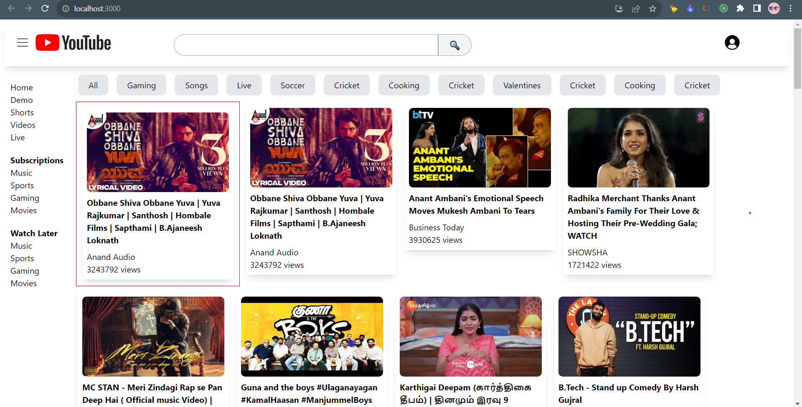
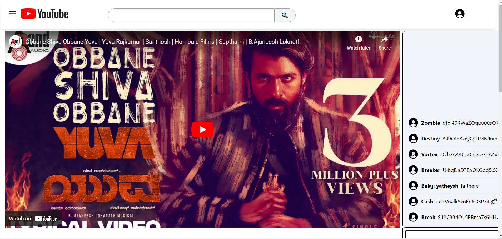
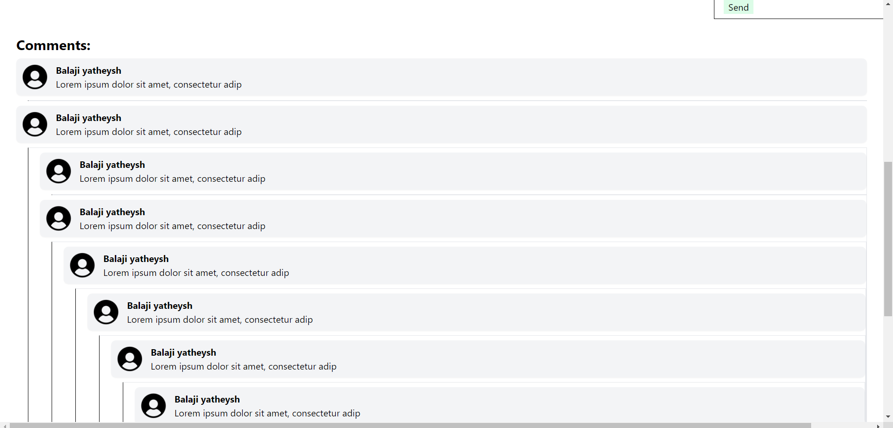
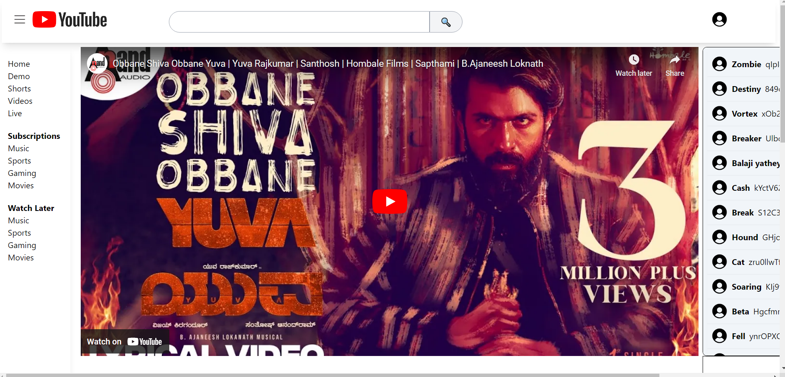

# Youtube clone

Built a functional YouTube clone, replicating core features like video search, playback, and user interaction. Utilized React.js and modern web development practices to ensure a smooth and responsive user experience.

## Run Locally

Clone the project

```bash
  git clone https://link-to-project
```

Go to the project directory

```bash
  cd my-project
```

Install dependencies

```bash
  npm install
```

Start the server

```bash
  npm run start
```


## Screenshots










## Feedback

If you have any feedback, please reach out to us at balajiyatheysh87@gmail.com

